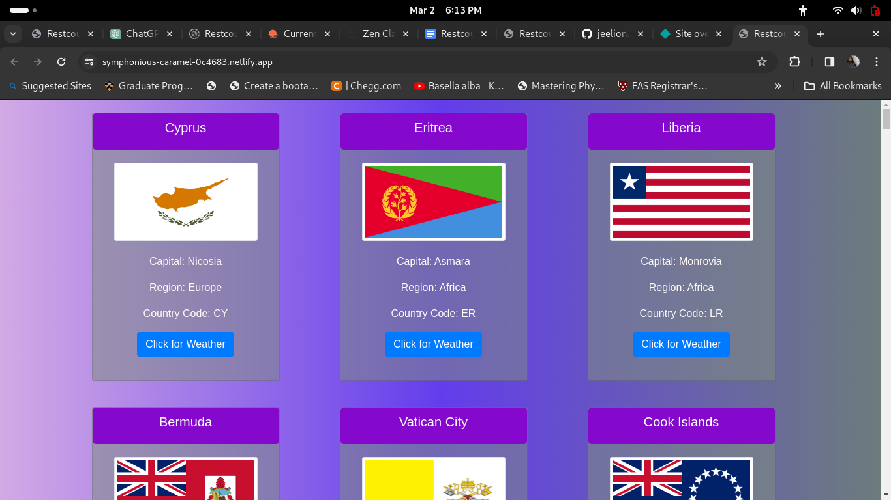
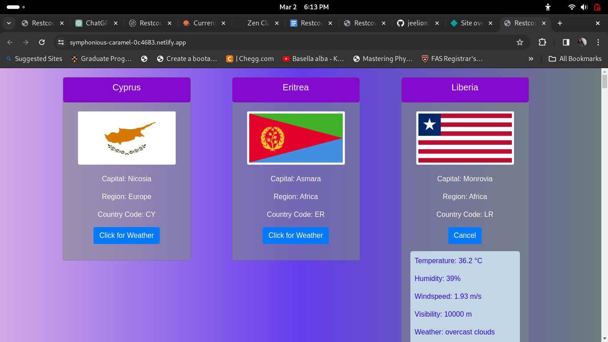

# Countries with Current Weather

It is a web page shows a card for each countries. The following details available in each card are; 1. Country Name, 2. Flag, 3. Capital, 4. Region, 5. Country Code, and a button for get current weather of the country.

Brief description of the project.

## Table of Contents

- [Introduction](#introduction)
- [Project Images](#Images)
- [Installation](#installation)
- [Usage](#usage)
- [Contributing](#contributing)
- [License](#license)

## Introduction

In this web page you can see countries cards grids and each button"Click for Weather" for each card. When you clik this button, country's current weather will be displayed that is there will be seen a card that shows the current weather details like temperature, humidity, wind speed, visibility, and the current sky condition. And when click "Cancel", the weather info will be hidden. To acheive all of these, the fetch() method is used to get data from both restcountries and opernweathermap APIs for country and country specific weather information. All of the html elements are created dynamically using DOM along with bootstrap4.6 for styling. For additional styling, external css sheet is used. At finally, the web page is deployed in Netlify. 

[Netlify link](https://symphonious-caramel-0c4683.netlify.app/)

## Images

## Installation

No installation is required except a latest web browser.

## Usage

It can be used for countries specific weather information.

## License

It will be updated soon

---

